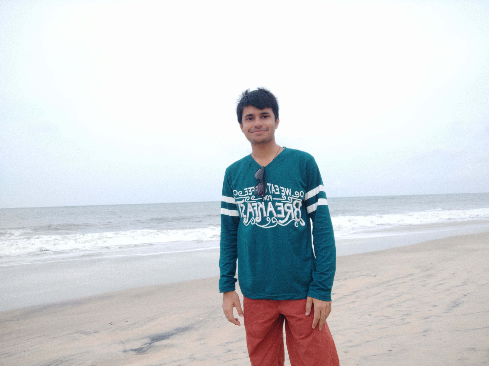

    

<h2 align="center"> (0_0)/~ Hello there! I am Rishabh Bhatt 👋 </h2>
<h3 align="center"> A passionate and hardworking individual, interested in tech, with an aim to change the world! </h3>

---

### Experience 📈

- 🤵 Currently Interning at: 
- 🙌 Communities active with:   

- 🔭 Have played around with:           

- 🔧 Using the following tools:    

- 🌱 Currently learning:  

- 📜 For more details, visit 

---

### Feel Free To Contact Me 📱

  

---

